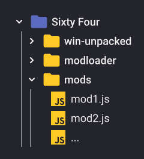
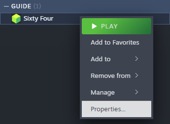
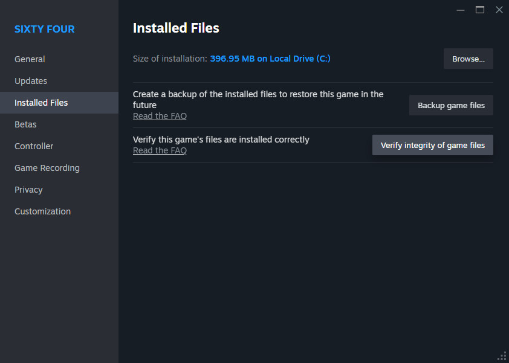
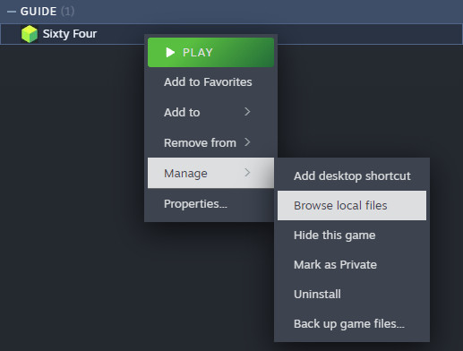
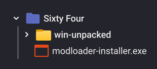
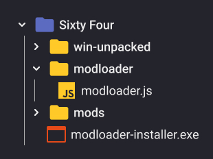
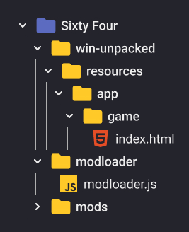

# Sixty Four Mods

This directory contains ready to use modloader and mod files.

## Mods

When you have the modloader installed, you simply put the mod files (**.js**)
you download into the mods folder.



You can get some mods from this repository:

- [**Dynamic Prices**](./dynamic-prices.js): Scale build prices and their
  increase rate.
- [**Grid Lines**](./grid-lines.js): Display grid in the background.
- [**Improved Silos**](./improved-silos.js): Configure refill cost and capacity
  of silos.
- [**Compact Shop**](./compact-shop.js): Make the minimized shop even more
  compact.

You can also look for more mods on the
[game's wiki modding page](https://sixtyfour.game-vault.net/wiki/Modding:Index)

## Mod Loader

<details>
<summary>Read this expandable section if you used the old loader</summary>

If you have played the game with the old mod loader you should remove the old
modding files and verify the game files through steam to clean up any leftovers.

To do that:

- **Right click** on the game inside your Steam library, and open it's
  **Properties**.

  

- Navigate to the **Installed Files** tab and click on **Verify integrity of
  game files**.

  

</details>

Download either the
[modloader-installer.exe](./modloader/modloader-installer.exe) (automatic
installation) or the [modloader.js](./modloader/modloader.js) (manual
installation)

Navigate to the game files. **Right click** on the game inside your Steam
library and choose **Browse Local Files**.



To install the modloader you can either use the provided automatic installer or
do that manually manually as explained below.

> [!IMPORTANT]
>
> When the game updates, you might need to repeat the modloader installation
> step. Specifically the code injection step, or just run the installer again.

> [!NOTE]
>
> On MacOS you need to do an additional step as explained in the legacy modding
> section on the game's wiki
> [HERE](https://sixtyfour.game-vault.net/wiki/Modding:Index#MacOS_Modding)
> before proceeding further.

### Automatic Installer

The installer is just a convenience tool that unpacks the modloader files,
creates folders, and injects minimal necessary code into the game.

> [!NOTE]
>
> The installer has the **modloader.js** embedded inside, meaning when a new
> version of the modloader is release, you need to download the new installer.

Put the **modloader-installer.exe** into the game folder, next to
**win-unpacked**, then run it.

Before installation:



The installer will unpack the modloader files, inject necessary code into game
files, and create the mods folder:



### Manual Installation

A quick step by step:

- Next to **win-unpacked**, create 2 folders **modloader** and **mods**.
- Put the downloaded **modloader.js** into the **modloader** folder.
- Navigate to **win-unpacked/resources/app/game** and openthe **index.html**
  file in a text editor.
- Locate `</head>` near the middle of the file. Pay attention to the `/` as
  there will be a different simillar looking piece of code.
- Copy this and paste it directly before `</head>`:

  ```html
  <script src="../../../../modloader/modloader.js"></script>
  ```

The full folder structure for reference:



## Getting help

In case of any issues you can ask for help on the
[game's discord server](https://discord.com/invite/7YXd3tScqS) or
[Report a Bug](https://github.com/rafalberezin/sixty-four-mods/issues/new?template=bug-report.yml)
if you encountered a bug.
