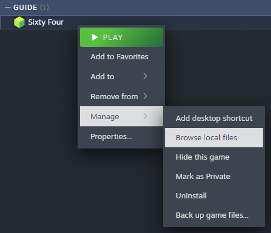
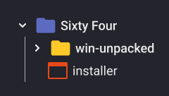
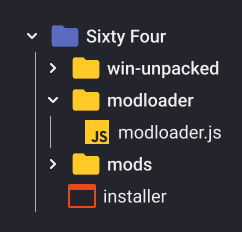
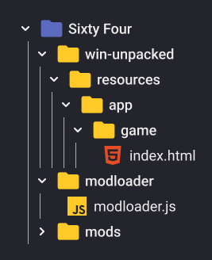
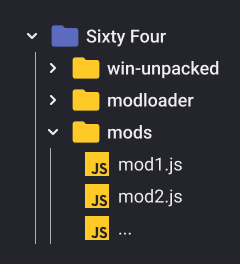
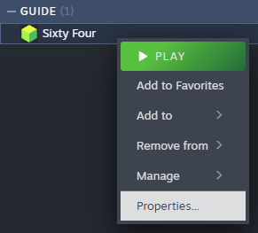
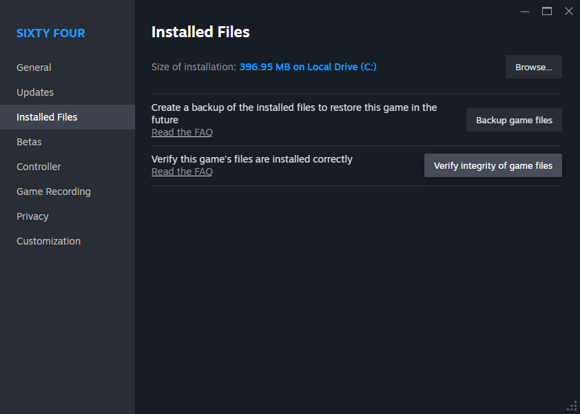

# Using Mod Loader

## Installing Mod Loader

If you used old mods **before this mod loader** you should
[remove them first](#removing-old-files).

The modloader can be installed either:

- [**Using the installer**](#automatic-installer): available for **Windows** and
  **Linux**
- [**Manually**](#manual-installation)

> [!IMPORTANT]
>
> When the game updates you **might** need to repeat the modloader installation.
> Specifically the code injection step (for manual installation), or just run
> the installer again.

### Automatic Installer

The installer is just a convenience tool that unpacks the mod loader files,
creates folders, and injects minimal necessary code into the game.

> [!NOTE]
>
> The installer has the actual `modloader.js` embedded inside, and doesn't
> download it when run, meaning when a new version of the mod loader is
> released, you need to download the new installer.

1. Download the either the
   [modloader-installer-windows.exe](https://github.com/rafalberezin/sixty-four-mods/releases/download/modloader-latest/modloader-installer-windows.exe)
   for Windows or
   [modloader-installer-linux](https://github.com/rafalberezin/sixty-four-mods/releases/download/modloader-latest/modloader-installer-linux)
   for Linux.

2. Open the game folder. To do that, **right click** on the game inside your
   Steam library and choose **Browse Local Files**.

   

3. Place the downloaded installer inside the game folder, next to
   `win-unpacked`.

   

4. Run the installer. The installer will inpack the mod loader files, inject
   necessary code into the game, and create the mods folder. If any issues occur
   you will be informed by the installer. After successful installation you
   should have:

   

### Manual Installation

> [!IMPORTANT]
>
> On MacOS you might need to do an additional step as explained in the legacy
> modding section on the game's wiki
> [HERE](https://sixtyfour.game-vault.net/wiki/Modding:Index#MacOS_Modding).

1. Download the
   [modloader.js](https://github.com/rafalberezin/sixty-four-mods/tree/master/dist/modloader/modloader.js)

2. Open the game folder. To do that, **right click** on the game inside your
   Steam library and choose **Browse Local Files**.

   

3. Next to `win-unpacked`, create 2 folders `modloader` and `mods`.
4. Put the downloaded `modloader.js` into the `modloader` folder
5. Navigate to `win-unpacked/resource/app/game` and open the `index.html` file
   in a **text editor**.
6. Locate `</head>` near the middle of the file. Pay attention to the `/` as
   there will be a simillar looking piece of code in this file.
7. Copy this and paste this directly before `</head>`:

   ```html
   <script src="../../../../modloader/modloader.js"></script>
   ```

The full folder structure should look like this:



## Installing Mods

When you have the modloader installed, you simply put the mod files (`.js`) you
downloaded into the `mods` folder.



You can find my mods [here](./02-mods)

You can also look for more mods on the
[game's wiki modding page](https://sixtyfour.game-vault.net/wiki/Modding:Index)

## Removing old files

If you used the old autoloader or other old mods, you should remove them, then
verify game files integrity, to let Steam clear any leftovers inside them. To do
that:

1. **Right click** on the game inside Steam library, and open it's
   **Properties**.

   

2. Navigate to the **Installed Files** tab and click on **Verify integrity of
   game files**.

   

After that's done you can [Install the Mod Loader](#installing-mod-loader).

## Getting help

In case of any issues you can ask for help on the
[game's discord server](https://discord.com/invite/7YXd3tScqS) or
[Report a Bug](https://github.com/rafalberezin/sixty-four-mods/issues/new?template=bug-report.yml)
if you encountered a bug with the mod loader or one of my mods.
