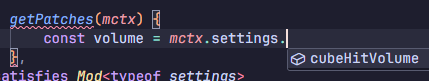
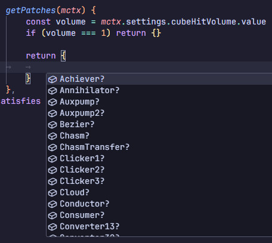
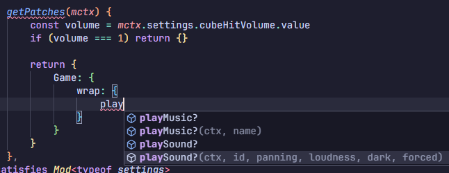
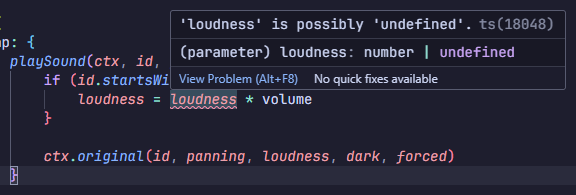

# Using TypeScript

Like mentioned before, I provide types you can use while making your mod. Those
define the modding API, and describe what is available to be modified in the
game.

In this guide we'll expand on the example from the
[Patching Methods](./06-patching-methods.md) section, to use TypeScript.

> [!NOTE]
>
> The mappings **DO NOT** contain all the fields for each of game classes, only
> the methods.

## Setting Up the Environment

1. Install [Node.js](https://nodejs.org) and create a new project.
2. Install TypeScript - `npm install typescript --save-dev`
   ([learn more](https://www.typescriptlang.org/download/))
3. Install esbuild - `npm install --save-exact --save-dev esbuild`
   ([learn more](https://esbuild.github.io/))

   This step is **optional, but recommended**, and I'll be using it in this
   guide.

## Getting Types

Due to a rather niche use case, I decided not to publish the types. Instead you
can download get them directly and place in your project.

- [Game Mappings](https://github.com/rafalberezin/sixty-four-mods/releases/download/mappings-latest/game.d.ts)
- [Mod Loader Types](https://github.com/rafalberezin/sixty-four-mods/releases/download/modloader-latest/modloader.d.ts)

## Using Types

The 2 main types you will be interacting with directly are:

- **Mod**
- **ModSettingsDefinition**

### Getting hints

To get hints while writing your mod, use the 2 types mentioned above to validate
your mod and settings objects using these types.

The `Mod` type takes a generic parameter for the type of your
`ModSettingsDefinition`. This will provide you with hints about the processed
settings in the `ModContext` objects you receive.

USe `satisfies` keyword to validate your objects while preserving the exact
types, to get the hints.

Let's start by defining the minimal mod structure and the settings:

```ts lines|highlight=1,2,4,5,16,27-28,30-31
// Assuming the type declaration files are next to this file.
import type { Mod, ModSettingsDefinition } from './modloader'

// Define the settings object outside of mod to use it's type later.
const settings = {
	cubeHitVolume: {
		type: 'number',
		name: 'Cube Hit Sound Volume',
		default: 0.3,
		sanitize: (val, def) => {
			if (val < 0) return 0
			if (val > 1) return 1
			return val
		}
	}
} satisfies ModSettingsDefinition

export default {
	id: 'quiet-cubes',
	name: 'Quiet Cubes',
	description: 'Change volume of hitting cubes',

	version: '1.0.0',
	gameVersion: '1.2.1',
	loaderVersion: '1.1.0',

	// Define the mod settings from the variable.
	settings

	// Provide the Mod type with the exact type of your settings for hints
} satisfies Mod<typeof settings>
```

Next, let's define the patch like we did before. When you start writing the
code, you should start getting hints for both your settings, and the patch spec.

> [!TIP]
>
> In **VS Code** you can press `Ctrl + Space`, while inside the `{}`, to get the
> suggestions for available **settings** / **classes** / **methods**, etc.







Now you will also see if there are any issues in the code. And in fact, our
example itself has a minor potential issue: `loudness` can be `undefined`.



Let's quickly fix that, if it's undefined, we'll default it to 1:

```ts lines=30|highlight=39
getPatches(mctx) {
	const volume = mctx.settings.cubeHitVolume.value
	if (volume === 1) return {}

	return {
		Game: {
			wrap: {
				playSound(ctx, id, panning, loudness, dark, forced) {
					if (id.startsWith('tap')) {
						loudness = (loudness ?? 1) * volume
					}

					ctx.original(id, panning, loudness, dark, forced)
				}
			}
		}
	}
}
```

### Augmenting Types

Like mentioned above, the mappings only include classes and their methods, but
not fields. That means you need to find what you need in the game yourself.

Additionally, to use these and your custom fields, you need to inform TypeScript
that they are available and what are their types. To do that you can augment the
types for the specific classes.

Define a **global scope**, then specify interfaces named like the classes you
want to augment, and specify the fields you want to use inside.

For example, the `compact-shop` mod uses the `shopToggle` field of the `Shop`
class. It augments the class like so:

```ts
declare global {
	interface Shop {
		shopToggle: HTMLDivElement
	}
}
```

Now TypeScript will recognize that instances of `Shop` contain field
`shopToggle` which is a `HTMLDivElement`.

## Bundling for distribution

You cannot put TypeScript mods directly into the game. Additionally, maybe you
noticed, that the first example here, is not written in CommonJS, and is instead
an ES Module, e.g.:

```js
export default {
	// ...
}
```

Instead of:

```js
module.exports = {
	// ...
}
```

This also cannot be used directly in the game.

You final mod distributable **MUST** be a **single CommonJS file**, written in
**JavaScript**.

If you are familiar with build tools, then you should know what to do with this.

But if you're not, then my recommended build setup uses `esbuild`. (see
[Setting Up the Environment](#setting-up-the-environment) for installation)

Simply add this build script to your `package.json`:

```json
{
	"scripts": {
		"build": "esbuild --bundle --platform=node --format=cjs --target=es2023 source-file.ts --outfile=target-file.js"
	}
}
```

Just make sure to replace:

- `source-file.ts` - With relative path to your source file.
- `target-file.js` - With relative path to where the you want the built file to
  appear.

Then you can simply run: `npm run build`, and copy the resulting file into the
mods folder.

If everything works you're ready for
[distributions](./00-introduction.md#distribution).
